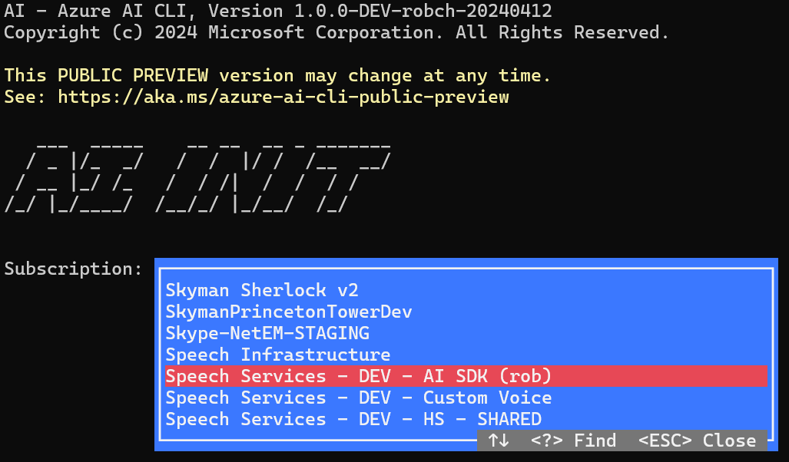
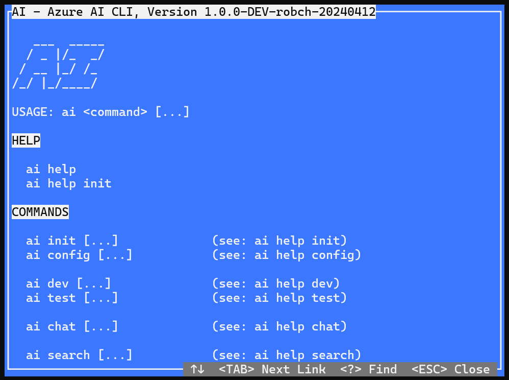

Status: Draft in Progress
Owner: Rob Chambers

# Using the Azure AI CLI

The Azure `AI` Command-Line Interface (CLI) is a cross-platform command-line tool to connect to Azure AI services and execute control-plane and data-plane operations without having to write any code. The CLI allows the execution of commands through a terminal using interactive command-line prompts or via script.

You can easily use the `AI` CLI to experiment with key Azure AI service features and see how they work with your use cases. Within minutes, you can setup all the required Azure resources needed, and build a customized Copilot using Azure OpenAI's chat completions APIs and your own data. You can try it out interactively, or script larger processes to automate your own workflows and evaluations as part of your CI/CD system.

In the future, you'll even be able to use the `AI` CLI to dynamically create code in the programming language of your choice to integrate with your own applications.

## **STEP 1**: Setup your development environment

You can install the Azure `AI` CLI locally on Linux, Mac, or Windows computers, or use it thru an internet browser or Docker container.

During this public preview, we recommend using the Azure `AI` CLI thru GitHub Codespaces. This will allow you to quickly get started without having to install anything locally.

### OPTION 1: GitHub Codespaces

You can run the Azure `AI` CLI in a browser using GitHub Codespaces:

[](https://codespaces.new/Azure/azure-ai-cli?quickstart=1)

</div><div class="content" id="content2">

### OPTION 2: VS Code Dev Container

You can run the Azure `AI` CLI in a Docker container using VS Code Dev Containers:

1. Follow the [installation instructions](https://code.visualstudio.com/docs/devcontainers/containers#_installation) for VS Code Dev Containers.
2. Clone the [azure-ai-cli](https://github.com/Azure/azure-ai-cli) repository and open it with VS Code:
    ```
    git clone https://github.com/Azure/azure-ai-cli
    code azure-ai-cli
    ```
3. Click the button "Reopen in Dev Containers", if it does not appear open the command pallete (`Ctrl+Shift+P` on Windows/Linux, `Cmd+Shift+P` on macOS) and run the `Dev Containers: Reopen in Container` command

</div><div class="content" id="content3">

## **STEP 2**: Initialize resource connections and configuration w/ `ai init`

You can initialize the Azure `AI` CLI by running the following command:

```
ai init
```



Follow the prompts, selecting the Azure subscription, followed by selecting or creating the Azure AI services you want to use.


## **STEP 3**: Inspect various command options and examples w/ `ai help`

You can interactively browse and explore the Azure `AI` CLI commands and options by running the following command:

```
ai help
```




## **STEP 4**:  Chat with your LLM w/ `ai chat`

You can chat interactively or non-interactively with an AI language model using the `ai chat` command.

**Interactive chat**

```bash
ai chat --interactive --system @prompt.txt
```

**Non-interactive chat**

```bash
ai chat --system @prompt.txt --user "Tell me about Azure AI Studio"
```

**Command line options**

```
USAGE: ai chat [...]

  CONNECTION                            (see: ai help connection)
    --deployment DEPLOYMENT             (see: ai help chat deployment)
    --endpoint ENDPOINT                 (see: ai help chat endpoint)
    --key KEY                           (see: ai help chat key)

  INPUT                                 (see: ai help chat input)
    --interactive                       (see: ai help chat interactive)
    --system PROMPT                     (see: ai help chat system prompt)
  * --file FILE                         (see: ai help chat history file)
  * --files PATTERN                     (see: ai help chat history files)
  * --files @FILELIST.txt               (see: ai help chat history files)
  * --json FILE                         (see: ai help chat history json)
  * --jsonl FILE                        (see: ai help chat history jsonl)
    --user MESSAGE                      (see: ai help chat user message)

  * - COMING SOON

  OPTIONS                               (see: ai help chat options)
    --temperature TEMPERATURE           (see: ai help chat options temperature)
    --max-tokens MAX_TOKENS             (see: ai help chat options max-tokens)
    --top-p TOP_P                       (see: ai help chat options top-p)
    --n N                               (see: ai help chat options n)
```

## **STEP 5**: Create and update an AI Search Index w/ `ai search index update`

You can create an AI Search Index using the `ai search index create` command.

```bash
ai search index update --files "../../data/3-product-info/*.md" --index-name "product-info"
```

**Command line options**

```
AI - Azure AI CLI, Version 1.0.0
Copyright (c) 2024 Microsoft Corporation. All Rights Reserved.

This PUBLIC PREVIEW version may change at any time.
See: https://aka.ms/azure-ai-cli-public-preview

SEARCH INDEX UPDATE

  The ai search index update command updates a vector index.

USAGE: ai index update [...]

  EMBEDDINGS
    --embedding-index-name NAME             (see: ai help search index embedding name)
    --embedding-deployment DEPLOYMENT       (see: ai help search index embedding deployment)

  ITEM
    --id ID                                 (see: ai help search index id)
    --metadata METADATA                     (see: ai help search index metadata)
    --description DESCRIPTION               (see: ai help search index description)

  DATA
    --text TEXT                             (see: ai help search index text)
    --file FILE                             (see: ai help search index file)
    --files FILES                           (see: ai help search index files)
    --url URL                               (see: ai help search index url)
    --urls URLs                             (see: ai help search index urls)

  REFERENCE
    --external-source                       (see: ai help search index external source)

  AZURE SEARCH
    --search-endpoint ENDPOINT               (see: ai help search endpoint)
    --search-api-key KEY                     (see: ai help search api key)
```

## **STEP 6**: Chat with your LLM using your AI Search Index w/ `ai chat --index-name`

You can chat interactively or non-interactively with an AI language model with your AI Search indexed data using the `ai chat` command with the `--index-name` option.

First, let's create a system prompt file that will be used to seed the chat with a question about a product:

```bash
nano prompt.txt
```

Copy and paste the following text into the file:

```
You are an AI assistant helping users with queries related to
outdoor/camping gear and clothing. Use the following pieces of context
to answer the questions about outdoor/camping gear and clothing as
completely, correctly, and concisely as possible. If the question is not
related to outdoor/camping gear and clothing, just say Sorry, I only can
answer question related to outdoor/camping gear and clothing. So how can
I help? Don't try to make up an answer. If the question is related to
outdoor/camping gear and clothing but vague ask for clarifying questions.
Do not add documentation reference in the response.
```

**Interactive chat**

```bash
ai chat --interactive --system @prompt.txt --index-name "product-info"
```

**Non-interactive chat**

```bash
ai chat --system @prompt.txt --index-name "product-info" --user "Which tent has the highest rainfly waterproof rating?"
```
