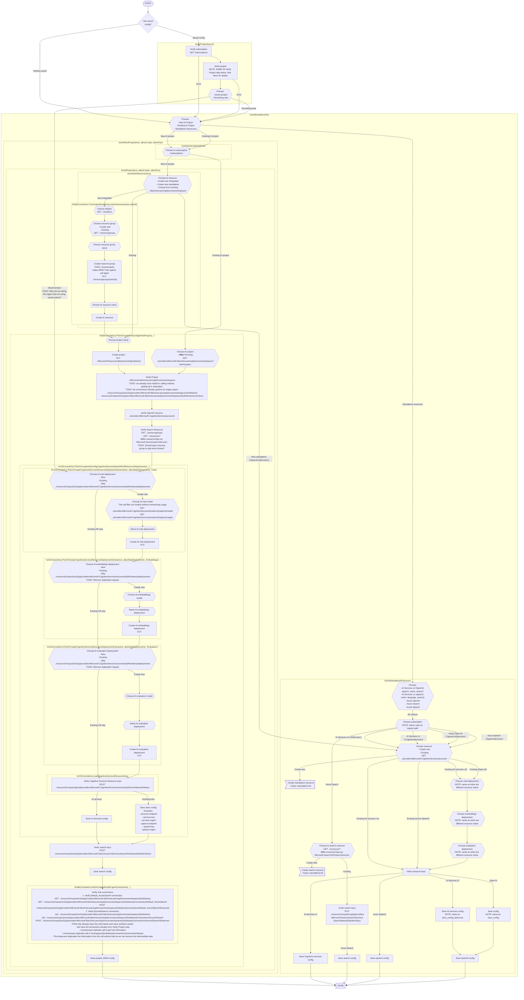

# AI init flow

This focuses on the UI that the user sees and will duplicate some shared code paths for clarity

```mermaid
flowchart
  %% ===========================================
  %% Subgraphs and node definitions
  %% ===========================================
  start([START])
  done[[DONE]]

  subgraph "VerifyProjectAsync()"
    saved_verify_subs["`Verify subscription
        *GET /subscriptions*`"]
    saved_verify_project["`Verify project
        NOTE: SAME AS Verify Project step below. See there for details`"]
    saved_choose_saved_or_else{{Choose:
        - Saved project
        - Something else}}
  end

  subgraph DoInitRootMenuPick
    top_level_choose{{"Choose:
      - New AI Project
      - Existing AI Project
      - Standalone Resources
      "}}
    
    subgraph "DoInitRootProject(true, allowCreate, allowPick)"
      subgraph "DoInitSubscriptionId(true)"
        choose_subs{{"`Choose AI subscription
          */subscriptions*`"}}
      end
      subgraph "DoInitProject(true, allowCreate, allowPick)"
        subgraph "DoInitHubResource(true)"
          newai_choose_res{{"`Choose AI resource
            - Create new integrated
            - Create new standalone
            - Choose from existing
            *../MachineLearningServices/workspaces*`"}}

          subgraph "AiSdkConsoleGui.TryCreateAiHubResourceInteractive(values,subsId)"
            newai_choose_region{{"`Choose Region
              *GET ../locations*`"}}
            newai_choose_resgrp{{"`Choose resource group
              - Create new
              - Existing
              *GET ../resourcegroups*`"}}
            newai_name_resgrp{{Choose resource group name}}
            newai_create_resgrp["`Create resource group
                TODO: unnecessarily makes REST Get regions call again
                *PUT ../resourcegroups/{resGrp}*`"]
            newai_choose_aires_name{{Choose AI resource name}}
            newai_create_aires[Create AI resource]
          end
        end

        subgraph "AiSdkConsoleGui.PickOrCreateAndConfigAiHubProject(...)"
          newai_choose_proj_name{{Choose project name}}
          newai_create_proj["`Create project
              *PUT ../Microsoft.Resources/deployments/{projName}*`"]

          existingai_choose_ai_proj{{"`Choose AI project
                - ___ONLY___ Existing
                *GET ../providers/Microsoft.MachineLearningServices/workspaces?kind=project*`"}}

          verify_project["`Verify Project
              *../Microsoft.MachineLearningServices/workspaces*
              TODO: we already have HubId in calling method,
              getting all is redundant
              TODO: list connecitons already queries for single project
              *../resourceGroups/{resGrp}/providers/Microsoft.MachineLearningServices/workspaces/{hubName}*
              *../resourceGroups/{resGrp}/providers/Microsoft.MachineLearningServices/workspaces/{hubName}/connections*`"]
          verify_ai_res["`Verify OpenAI resource
              *../providers/Microsoft.CognitiveServices/accounts*`"]
          verify_search_conn["`Verify Search Resource
              *GET ../resourcegroups*
              *GET ../resources?$filter=resourceType eq 'Microsoft.Search/searchServices'*
              TODO: Should pass resource group to skip extra lookup?`"]

          subgraph "AzCliConsoleGui.PickOrCreateAndConfigCognitiveServicesOpenAiKindResourceDeployments(...)"
            subgraph "AzCliConsoleGui.PickOrCreateCognitiveServicesResourceDeployment(interactive, allowSkipDeployments, 'Chat')"
              choose_chat_deployment{{"`Choose AI chat deployment
                  - New
                  - Existing
                  - Skip
                  *../resourceGroups/{resGrp}/providers/Microsoft.CognitiveServices/accounts/{aiResName}/deployments*`"}}
              choose_chat_model{{"`Choose AI chat model
                  This will filter out models without remamining usage
                  *GET ../providers/Microsoft.CognitiveServices/locations/{region}/models*
                  *GET ../providers/Microsoft.CognitiveServices/locations/{region}/usages*`"}}
              name_chat_deployment{{Name AI chat deployment}}
              create_chat_deployment["`Create AI chat deployment
                  *PUT*`"]
            end
            subgraph "AzCliConsoleGui.PickOrCreateCognitiveServicesResourceDeployment(interactive, allowSkipDeployments, 'Embeddings')"
              choose_embed_deployment{{"`Choose AI embeddings deployment
                  - New
                  - Existing
                  - Skip
                  *../resourceGroups/{resGrp}/providers/Microsoft.CognitiveServices/accounts/{aiResName}/deployments*
                  TODO: Remove duplicated request`"}}
              choose_embed_model{{"`Choose AI embedddings model`"}}
              name_embed_deployment{{Name AI embeddings deployment}}
              create_embed_deployment["`Create AI embeddings deployment
                  *PUT*`"]
            end
            subgraph "AzCliConsoleGui.PickOrCreateCognitiveServicesResourceDeployment(interactive, allowSkipDeployments, 'Evaluation')"
              choose_eval_deployment{{"`Choose AI evaluation deployment
                  - New
                  - Existing
                  - Skip
                  *../resourceGroups/{resGrp}/providers/Microsoft.CognitiveServices/accounts/{aiResName}/deployments*
                  TODO: Remove duplicated request`"}}
              choose_eval_model{{"`Choose AI evaluation model`"}}
              name_eval_deployment{{Name AI evaluation deployment}}
              create_eval_deployment["`Create AI evaluation deployment
                  *PUT*`"]
            end

            subgraph "AzCliConsoleGui.LoadCognitiveServicesResourceKeys"
              verify_reskeys["`Verify Cognitive Services Resource keys
                  *POST ../resourceGroups/{regGrp}/providers/Microsoft.CognitiveServices/accounts/{aiServiceName}/listKeys*`"]
            end

            save_config_aiservces[Save AI Services config]
            save_config["`Save other config
                Excludes:
                - services.endpoint
                - services.key
                - services.region
                - speech.endpoint
                - speech.key
                - speech.region`"]
          end

          verify_searchkeys["`Verify search keys
              *POST ../resourceGroups/{resGrp}/providers/Microsoft.Search/searchServices/{searchResName}/listAdminKeys*`"]
          save_search["Save search config"]

          subgraph "AiSdkConsoleGui.GetOrCreateAiHubProjectConnections(...)"
            verify_hub_conn["`Verify hub connections
                1. Verify Default_AzureOpenAI connection:
                  *GET ../resourceGroups/{resGrp}/providers/Microsoft.MachineLearningServices/workspaces/{hubName}*
                  *GET ../resourceGroups/{resGrp}/providers/Microsoft.MachineLearningServices/workspaces/{hubName}/connections/Default_AzureOpenAI*
                  *POST ../resourceGroups/{resGrp}/providers/Microsoft.MachineLearningServices/workspaces/{hubName}/connections/Default_AzureOpenAI/listsecrets*
                2. Verify AzureAISearch connection:
                  *Get ../resourceGroups/{resGrp}/providers/Microsoft.MachineLearningServices/workspaces/{hubName}*
                  *Get ../resourceGroups/{resGrp}/providers/Microsoft.MachineLearningServices/workspaces/{hubName}/connections/AzureAISearch*
                  *POST ../resourceGroups/{resGrp}/providers/Microsoft.MachineLearningServices/workspaces/{hubName}/connections/AzureAISearch/listsecrets*
                TODO We already have this information and have verified it earlier
                - We have all connections already from Verify Project step
                - Unnecessary triplicate call to get hub information
                - Unnecessary duplicate call to /workspaces/{hubName}/connections/{connectionName}
                - The listsecrets duplicates the information from the call without that so we can remove the intermediate step`"]
          %% == "AiSdkConsoleGui.GetOrCreateAiHubProjectConnections(...)"
          end

          save_config_json["Save project JSON config"]
        %% == "AiSdkConsoleGui.PickOrCreateAndConfigAiHubProject(...)"
        end

      %% == "DoInitProject(interactive, allowCreate, allowPick)"
      end
    %% == "DoInitRootProject(true, allowCreate, allowPick)"
    end

    subgraph "DoInitStandaloneResources"
      standalone_choose_type{{"`Choose:
          - AI Services v2 (OpenAI, speech, vision, search)
          - AI Services v1 (speech, vision, language, search)
          - Azure OpenAI
          - Azure Search
          - Azure Speech`"}}
      standalone_choose_subs{{"`Choose subscription
          NOTE: Same code as regular path`"}}
      standalone_choose_resource{{"`Choose resource
          - Create new
          - Existing
          *GET ../providers/Microsoft.CognitiveServices/accounts*`"}}
      standalone_create_resource>"`Create standalone resource
          TODO: INCOMPLETE`"]
      standalone_choose_search_resource{{"`Choose AI search resource
          *GET ../resources?$filter=resourceType eq 'Microsoft.Search%2FsearchServices'*`"}}
      standalone_create_search_resource>"`Create search resource
          TODO: INCOMPLETE`"]
      standalone_choose_chat_deployment{{"`Choose chat deployment
          NOTE: same as other but different resource name`"}}
      standalone_choose_embed_deployment{{"`Choose embeddings deployment
          NOTE: same as other but different resource name`"}}
      standalone_choose_eval_deployment{{"`Choose evaluation deployment
          NOTE: same as other but different resource name`"}}
      standalone_verify_res_keys[Verify resource keys]
      standalone_verify_search_keys["`Verify search keys
          *PUT ../resourceGroups/{resgrp}/providers
          /Microsoft.Search/searchServices/
          {searchName}/listAdminKeys`"]
      standalone_save_config_aiservices["`Save AI services config
          NOTE: same as save_config_aiservces`"]
      standalone_save_config["`Save config
          NOTE: same as save_config`"]
      standalone_save_config_cogsrv["Save Cognitive services config"]
      standalone_save_config_openai["Save OpenAI config"]
      standalone_save_config_search["Save search config"]
      standalone_save_config_speech["Save speech config"]

    %% == "DoInitStandaloneResources"
    end
  
  %% == "DoInitRootMenuPick"
  end

  
  %% ===========================================
  %% Flow
  %% ===========================================
  start --> has_saved_config{Has saved
      config?}

  has_saved_config --Nothing saved--> top_level_choose
  has_saved_config --Saved config--> saved_verify_subs
  saved_verify_subs --> saved_verify_project
  saved_verify_subs --Error--> top_level_choose
  saved_verify_project --Error-->  top_level_choose
  saved_verify_project --> saved_choose_saved_or_else
  saved_choose_saved_or_else --Something else--> top_level_choose
  saved_choose_saved_or_else --"`Saved project
      TODO: Why are we doing this again and not using saved values?`"--> choose_chat_deployment

  top_level_choose --New AI project--> choose_subs
  top_level_choose --Existing AI project--> choose_subs
  top_level_choose --Standalone resources --> standalone_choose_type

  choose_subs --New AI project--> newai_choose_res
  choose_subs --Existing AI project--> existingai_choose_ai_proj

  newai_choose_res --New integrated--> newai_choose_region
  newai_choose_region --> newai_choose_resgrp
  newai_choose_resgrp --> newai_name_resgrp

  newai_name_resgrp --> newai_create_resgrp
  newai_create_resgrp --> newai_choose_aires_name
  newai_choose_aires_name --> newai_create_aires
  newai_create_aires --> newai_choose_proj_name

  newai_choose_res --Existing--> newai_choose_proj_name
  newai_choose_proj_name --> newai_create_proj
  newai_create_proj --> verify_project
  verify_project --> verify_ai_res
  verify_ai_res --> verify_search_conn
  verify_search_conn --> choose_chat_deployment

  existingai_choose_ai_proj --> verify_project

  choose_chat_deployment --Existing OR skip--> choose_embed_deployment
  choose_chat_deployment --Create new--> choose_chat_model
  choose_chat_model --> name_chat_deployment
  name_chat_deployment --> create_chat_deployment
  create_chat_deployment --> choose_embed_deployment
  
  choose_embed_deployment --Existing OR skip--> choose_eval_deployment
  choose_embed_deployment --Create new--> choose_embed_model
  choose_embed_model --> name_embed_deployment
  name_embed_deployment --> create_embed_deployment
  create_embed_deployment --> choose_eval_deployment
  
  choose_eval_deployment --Existing OR skip--> verify_reskeys
  choose_eval_deployment --Create new--> choose_eval_model
  choose_eval_model --> name_eval_deployment
  name_eval_deployment --> create_eval_deployment
  create_eval_deployment --> verify_reskeys

  verify_reskeys --Anything else--> save_config
  verify_reskeys --AI services--> save_config_aiservces

  save_config_aiservces --> verify_searchkeys
  save_config --> verify_searchkeys

  verify_searchkeys --> save_search
  save_search --> verify_hub_conn
  verify_hub_conn --> save_config_json
  save_config_json--> done

  newai_choose_res --"`New standalone ('OpenAI;AIServices')`"--> standalone_choose_resource

  standalone_choose_type --All choices--> standalone_choose_subs
  standalone_choose_subs --"`AI Services v2 ('AIServices')`"--> standalone_choose_resource
  standalone_choose_subs --"`AI Services v1 ('CognitiveServices')`"--> standalone_choose_resource
  standalone_choose_subs --"`Azure Open AI ('OpenAI;AIServices')`"--> standalone_choose_resource
  standalone_choose_subs --Azure Search--> standalone_choose_search_resource
  standalone_choose_subs --"`Azure Speech ('SpeechServices')`"--> standalone_choose_resource

  standalone_choose_resource --Existing (AI services v2)--> standalone_choose_chat_deployment
  standalone_choose_resource --Existing (AI services v1)--> standalone_verify_res_keys
  standalone_choose_resource --Existing (Open AI)--> standalone_choose_chat_deployment
  standalone_choose_resource --Existing (Azure Speech) --> standalone_verify_res_keys

  standalone_choose_search_resource --Existing---> standalone_verify_search_keys
  standalone_choose_search_resource --Create new--> standalone_create_search_resource

  standalone_choose_chat_deployment --> standalone_choose_embed_deployment
  standalone_choose_embed_deployment --> standalone_choose_eval_deployment
  standalone_choose_eval_deployment --> standalone_verify_res_keys
  
  standalone_verify_res_keys --AI Services v2--> standalone_save_config_aiservices
  standalone_verify_res_keys --AI Services v1--> standalone_save_config_cogsrv
  standalone_verify_res_keys --Open AI--> standalone_save_config
  standalone_verify_search_keys --Azure Search--> standalone_save_config_search
  standalone_verify_res_keys --Azure Speech--> standalone_save_config_speech

  standalone_save_config_aiservices --> standalone_save_config_openai
  standalone_save_config_cogsrv --> done
  standalone_save_config --> standalone_save_config_openai
  standalone_save_config_search --> done
  standalone_save_config_speech --> done
  standalone_save_config_openai --> done

  standalone_choose_resource --Create new--> standalone_create_resource
```
