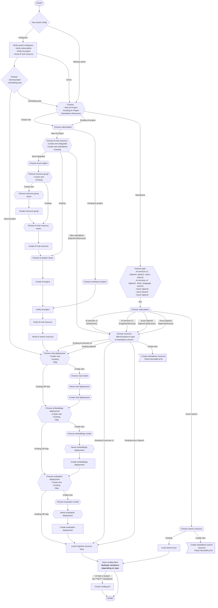

# Current AI init flow

```mermaid
flowchart
  start([START])
  done([DONE])

  start --> has_saved_config{Has saved config}
  has_saved_config --config.json--> verify_saved_config[Verify saved config.json
      - Verify subscription
      - Verify AI project
      - Verify AI hub resource]
  verify_saved_config --> choose_saved_or_other{Choose:
      - Saved project
      - Something else}
  verify_saved_config --Errors--> top_level_choose
  choose_saved_or_other --Saved project--> choose_chat_deployment
  choose_saved_or_other --Something else--> top_level_choose
  has_saved_config --Nothing saved--> top_level_choose{{"Choose:
      - New AI Project
      - Existing AI Project
      - Standalone Resources
      "}}
  
  top_level_choose --Create new--> choose_subs{{Choose subscription}}
  top_level_choose --Existing AI project--> choose_subs
  top_level_choose --Standalone--> standalone_choose_type{{"Choose type:
      - AI services v2 (OpenAI, speech, vision, search)
      - AI services v1 (Speech, vision, language, search)
      - Azure OpenAI
      - Azure Search
      - Azure Speech"}}

  standalone_choose_type --Any--> standalone_choose_subs{{Choose subscription}}
  standalone_choose_subs --"AI services v2
        (AIServices)"--> standalone_choose_res{{Choose resource
      filtered based on type of standalone chosen}}
  standalone_choose_subs --"AI services v1
        (CognitiveServices)"---> standalone_choose_res 
  standalone_choose_subs --"Azure OpenAI
        (OpenAI;AIServices)"--> standalone_choose_res
  standalone_choose_subs --"Azure Speech
        (SpeechServices)"--> standalone_choose_res
  standalone_choose_subs --Azure Search--> standalone_choose_search_res{{Choose search resource}}

  standalone_choose_res --Existing AI services v2--> choose_chat_deployment
  standalone_choose_res --Existing OpenAI--> choose_chat_deployment
  standalone_choose_res --Existing AI services v1--> load_cogsvc_keys
  standalone_choose_res --Existing Azure Speech--> load_cogsvc_keys
  standalone_choose_res --Create new--> create_standalone_res>Create standalone resource
      TODO INCOMPLETE]

  standalone_choose_search_res --Existing--> standalone_load_search_keys[Load search keys]
  standalone_load_search_keys --> save_config
  standalone_choose_search_res --Create new--> create_standalone_res_search>Create standalone search resource
      TODO INCOMPLETE]

  choose_subs --New AI project--> choose_ai_res{{Choose AI hub resource
      - Create new integrated
      - Create new standalone
      - Existing}}
  choose_subs --Existing AI project--> choose_existing_ai_proj{{Choose existing AI project}}
  
  choose_ai_res --New integrated--> choose_region{{Choose Azure region}}
  choose_ai_res --Existing--> choose_ai_proj_name{{Choose AI project}}
  choose_ai_res --"New standalone
      (OpenAI;AIServices)"--> standalone_choose_res

  choose_region --> choose_res_group{{Choose resource group
      - Create new
      - Existing}}

  choose_res_group --Create new--> choose_reg_group_name{{Choose resource group name}}
  choose_res_group --Existing--> choose_ai_res_name{{Choose AI hub resource name}}

  choose_reg_group_name --> create_res_group[Create resource group]
  create_res_group --> choose_ai_res_name
  choose_ai_res_name --> create_ai_res[Create AI hub resource]
  create_ai_res --> choose_ai_proj_name{{Choose AI project name}}

  choose_ai_proj_name --> create_ai_proj[Create AI project]
  create_ai_proj --> verify_ai_proj

  choose_existing_ai_proj --> verify_ai_proj[Verify AI project]
  verify_ai_proj --> verify_ai_res[Verify AI hub resource]
  verify_ai_res --> verify_ai_search_res[Verify AI search resource]
  verify_ai_search_res --> choose_chat_deployment{{Choose chat deployment
      - Create new
      - Existing
      - Skip}}

  choose_chat_deployment --Existing OR skip --> choose_embed_deployment{{Choose embeddings deployment
      - Create new
      - Existing
      - Skip}}
  choose_chat_deployment --Create new--> choose_chat_model{{Choose chat model}}
  choose_chat_model --> name_chat_deployment{{Name chat deployment}}
  name_chat_deployment --> create_chat_deployment{{Create chat deployment}}
  create_chat_deployment --> choose_embed_deployment

  choose_embed_deployment --Existing OR skip--> choose_eval_deployment{{Choose evaluation deployment
      - Create new
      - Existing
      - Skip}}
  choose_embed_deployment --Create new--> choose_embed_model{{Choose embeddings model}}
  choose_embed_model --> name_embed_deployment{{Name embeddings deployment}}
  name_embed_deployment --> create_embed_deployment[Create embeddings deployment]
  create_embed_deployment --> choose_eval_deployment

  choose_eval_deployment --Existing OR skip --> load_cogsvc_keys[Load Cognitive services keys]
  choose_eval_deployment --Create new--> choose_eval_model{{Choose evaluation model}}
  choose_eval_model --> name_eval_deployment{{Name evaluation deployment}}
  name_eval_deployment --> create_eval_deployment[Create evaluation deployment]
  create_eval_deployment --> load_cogsvc_keys

  load_cogsvc_keys --> save_config["`Save configuration
    **Multuple variations
    depending on type**`"]
  
  save_config --AI Hub or project
      but **NOT** standalone--> create_config_json[Create config.json]
  save_config --> done
  create_config_json --> done
```
