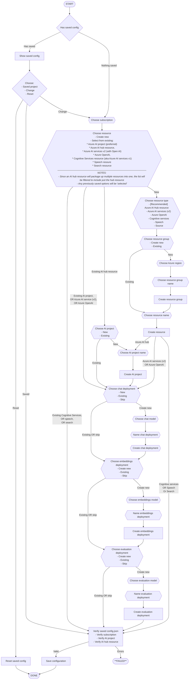

# New AI streamlined AI init flow

```mermaid
flowchart
  start([START])
  done([DONE])
  failed([**FAILED**])

  start --> has_saved_config{Has saved config}
  has_saved_config --Has saved--> show_saved_config[Show saved config]
  has_saved_config --Nothing saved--> choose_subs

  show_saved_config --> choose_saved_or_other{Choose:
      - Saved project
      - Change
      - Reset}

  choose_saved_or_other --Reset--> reset_config[Reset saved config] --> done
  choose_saved_or_other --Saved--> verify_config[Verify saved config.json
      - Verify subscription
      - Verify AI project
      - Verify AI hub resource]
  choose_saved_or_other --Change--> choose_subs{{Choose subscription}}

  choose_subs --> choose_res{{"`Choose resource
      - Create new
      - Select from existing:
        * Azure AI project (preferred)
        * Azure AI hub resource,
        * Azure AI services v2 (with Open AI)
        * Azure OpenAI,
        * Cognitive Services resource (aka Azure AI services v1)
        * Speech resoure
        * Search resource
      ___________________________________________________________________
      *NOTES:
      - Since an AI hub resource will package up multiple resources into one, the list will be filtered to include just the hub resource
      - Any previously saved options will be 'selected'*`"}}

  choose_res --Existing Cognitive Services,
      OR speech,
      OR search--> verify_config
  choose_res --Existing AI project,
      OR Azure AI service (v2),
      OR Azure OpenAI--> choose_chat_deployment{{Choose chat deployment
      - New
      - Existing
      - Skip}}
  choose_res --Existing AI hub resource--> choose_ai_proj{{Choose AI project
      - New
      - Existing}}
  choose_res --New--> choose_res_type{{"Choose resource type
      - [Recommended] Azure AI Hub resource
      - Azure AI services (v2)
      - Azure OpenAI
      - Cognitive services
      - Speech
      - Source"}}

  choose_ai_proj --Existing--> choose_chat_deployment
  choose_ai_proj --New--> choose_ai_proj_name{{Choose AI project name}}
  choose_ai_proj_name --> create_ai_proj[Create AI project]
  create_ai_proj --> choose_chat_deployment

  choose_chat_deployment --Existing OR skip --> choose_embed_deployment{{Choose embeddings deployment
      - Create new
      - Existing
      - Skip}}
  choose_chat_deployment --Create new--> choose_chat_model{{Choose chat model}}
  choose_chat_model --> name_chat_deployment{{Name chat deployment}}
  name_chat_deployment --> create_chat_deployment{{Create chat deployment}}
  create_chat_deployment --> choose_embed_deployment

  choose_embed_deployment --Existing OR skip--> choose_eval_deployment{{Choose evaluation deployment
      - Create new
      - Existing
      - Skip}}
  choose_embed_deployment --Create new--> choose_embed_model{{Choose embeddings model}}
  choose_embed_model --> name_embed_deployment{{Name embeddings deployment}}
  name_embed_deployment --> create_embed_deployment[Create embeddings deployment]
  create_embed_deployment --> choose_eval_deployment

  choose_eval_deployment --Existing OR skip --> verify_config
  choose_eval_deployment --Create new--> choose_eval_model{{Choose evaluation model}}
  choose_eval_model --> name_eval_deployment{{Name evaluation deployment}}
  name_eval_deployment --> create_eval_deployment[Create evaluation deployment]
  create_eval_deployment --> verify_config

  choose_res_type --> choose_res_group{{Choose resource group
      - Create new
      - Existing}}
  choose_res_group --Existing--> choose_res_name{{Choose resource name}}
  choose_res_group --New--> choose_region{{Choose Azure region}}

  choose_res_name --> create_res[Create resource]
  choose_region --> choose_res_group_name{{Choose resource group name}}
  choose_res_group_name --> create_res_group[Create resource group]
  create_res_group --> choose_res_name

  create_res --Azure AI hub--> choose_ai_proj_name
  create_res --Azure AI services (v2)
      OR Azure OpenAI--> choose_chat_deployment
  create_res --Cognitive services
      OR Speech
      Or Search--> verify_config
  
  verify_config --Valid--> save_config[Save configuration]
  verify_config --Errors--> failed
  save_config --> done
```
