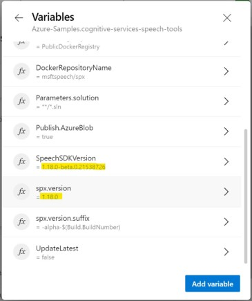

# How to compile SPX with a internal version of speech SDK?

Here we will assume the latest public version is 1.17, but you would like to compile against an internal 1.18 preview version (any internal Carbon build).


1. build carbon ([Yml - Carbon Build build pipeline](https://msasg.visualstudio.com/Skyman/_build?definitionId=4833&_a=summary)), and set the build variables "OVERRIDE_SPEECHSDK_NUGET_VSTS_PUSH=true" and "OVERRIDE_SPEECHSDK_VSTS_FEED=CarbonLite".  If you already have a build, you can download the nuget file and manually push it to the CarbonLite feed.

2. Schedual a build of [SPX](https://msasg.visualstudio.com/Skyman/_build?definitionId=13649) and set the SPX build variable "SpeechSDKVersion" to the full build number of carbon you want to use, example "1.18.0-alpha.0.15922490".
3. You will probably want to set the build number of SPX to the same base version as carbon. example set build variable "spx.version=1.18.0".  leave "spx.version.suffix" set to the default value if "-alpha-$(Build.BuildNumber)".



note: As soon as the build finishes, you will be able to pull the docker image if you use the full docker image  rather that "msftspeech/spx:latest".  from the above example, where you see the build name/number is "#```20210603.6``` Glharper/voice profile to carbon (#85)". You can use ```docker pull msftspeech/spx:1.18.0.20210603.6``` to pull the docker image from this build, which will have your "internal" build of carbon built into the container.


You can also go to the build artifcats tab of the SPX build, and download the SPX nuget package, which will include the internal version of carbon. after downloading it run ```dotnet tool install --global --add-source <download location of nupkg> Microsoft.CognitiveServices.Speech.CLI```
